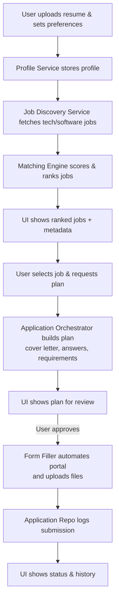

# Personal Job Application Assistant

An agent-driven system that discovers, ranks, and applies to software engineering jobs for a single user, with explicit approval before every application.

## Features

- Parse and store a user profile and resume
- Discover tech/software jobs from public sources (LinkedIn stub, Indeed stub, generic RSS)
- Rank jobs by match score and show:
  - Title, company, location
  - Salary & benefits (when available)
  - Required vs. missing qualifications
- Generate application plans:
  - Tailored cover letter draft
  - Answers to common application questions
  - List of special requirements (tests, videos, etc.)
- Submit applications automatically after user approval
- Upload and forward files (resume, cover letters, etc.) securely

## Architecture

| Component | Responsibility |
|---|---|
| **User Interface** | Collect preferences, show jobs, approvals, status |
| **Profile & Resume Service** | Parse, store, and expose user profile & documents |
| **Job Discovery Service** | Search and normalize tech/software jobs from public sources |
| **Matching & Ranking Engine** | Score jobs vs. profile and preferences |
| **Application Orchestrator** | Drive the "review → approve → apply" workflow |
| **Form Filler & Automation** | Navigate ATS/company portals, fill forms, upload files |
| **Storage Layer** | Persist profile, jobs, applications, logs |
| **Security & Audit Layer** | Handle secrets, logging, and safe data handling |

### Stack

- **Backend:** Node.js + TypeScript (Express)
- **Automation:** Playwright
- **Storage:** PostgreSQL (or in-memory for local dev)
- **API:** REST endpoints for profile, jobs, and applications
- **UI:** React/Next.js (recommended, not yet included)

### Workflow



## Folder Structure

```
job-application-assistant/
  README.md
  package.json
  tsconfig.json
  .env.example
  src/
    app.ts
    config/
      index.ts
    domain/
      userProfile.ts
      job.ts
      application.ts
    services/
      profileService.ts
      jobDiscoveryService/
        index.ts
        sources/
          linkedinSource.ts
          indeedSource.ts
          genericRssSource.ts
      matchingService.ts
      applicationOrchestrator.ts
      formFiller/
        index.ts
        playwrightClient.ts
    adapters/
      http/
        routes/
          profileRoutes.ts
          jobRoutes.ts
          applicationRoutes.ts
        server.ts
      persistence/
        prismaClient.ts
        userRepo.ts
        jobRepo.ts
        applicationRepo.ts
      storage/
        fileStorage.ts
```

## Getting Started

1. Clone the repo and install dependencies:

   ```bash
   npm install
   ```

2. Copy environment variables and update values:

   ```bash
   cp .env.example .env
   ```

3. (Optional) Set up a database. The app ships with in-memory repositories so you can start without one. To use Prisma with PostgreSQL:

   ```bash
   npm install @prisma/client
   npx prisma init
   # Edit prisma/schema.prisma, then:
   npx prisma migrate dev
   ```

4. Start the API:

   ```bash
   npm run dev
   ```

## API Reference

### Profile

| Method | Path | Description |
|--------|------|-------------|
| `POST` | `/api/profile` | Create or update a user profile |
| `GET` | `/api/profile/:id` | Get a profile by ID |

### Jobs

| Method | Path | Description |
|--------|------|-------------|
| `GET` | `/api/jobs?userId=<id>` | Discover and rank jobs for a user |

### Applications

| Method | Path | Description |
|--------|------|-------------|
| `POST` | `/api/applications/plan` | Build a draft application plan for a job |
| `POST` | `/api/applications/submit` | Submit an approved application |
| `GET` | `/api/applications?userId=<id>` | List application history for a user |
| `PATCH` | `/api/applications/:id/status` | Update an application's status |

### Health

| Method | Path | Description |
|--------|------|-------------|
| `GET` | `/health` | Server health check |

## Next Steps

- Integrate an LLM for:
  - Cover letter generation
  - Question answering
  - Special requirement explanation
- Add per-site automation strategies for major ATS portals (Greenhouse, Lever, Workday, etc.)
- Build a React/Next.js UI for:
  - Job review & approval
  - File upload
  - Application history
- Add BullMQ / Redis queue for background application runs
